# 基于图书管理系统的漏洞复现与代码审计

## 一、项目背景

本项目是基于SpringBoot + Vue的图书管理系统，实现了图书查询、借阅、借阅记录查看、用户登录注册等功能。在学习Web安全知识后，我对项目进行了主动的代码审计，发现两处高危漏洞：SQL注入和水平越权。

## 二、SQL注入漏洞

### 2.1漏洞原理：

### ${}和#{}的区别：

```
@Select("SELECT * FROM books WHERE book_name LIKE '%${bookName}%' AND author LIKE '%${author}%'")
```

这个是危险的写法，${}这个是字符串替换，直接把参数拼接到SQL里

举例：

用户输入：Java

SQL:SELECT * FROM books WHERE book_name LIKE '%Java%'

用户输入：' OR '1'='1' -- -

SQL:SELECT * FROM  books WHERE book_name LIKE '%' OR '1'='1' -- -%'

'1'='1'永远都是真的  逻辑就被篡改了

```
@Select("SELECT * FROM books WHERE book_name LIKE #{bookName} AND author LIKE #{author}")
```

这个是安全的写法 

#{}这个是预编译参数，这些参数会被当做纯文本来处理

举例：

用户输入：' OR '1'='1' -- -

SQL:SELECT * FROM books WHERE book_name LIKE ?(?是占位符)

数据库收到以后就是普通的字符串，不是SQL代码

### 2.2漏洞代码位置

BookMapper.java

```
@Select("SELECT * FROM books WHERE book_name LIKE '%${bookName}%' AND author LIKE '%${author}%'")
```

BookService.java

```
return bookMapper.searchBoooksVuln(
                nameEmpty ? "%" : bookName,
                authorEmpty ? "%" : author
        );
```

问题：直接把前端的数据喂给后端，没有做任何的处理

### 2.3复现步骤

##### 步骤1：验证漏洞存在

```Payload
bookName=' OR '1'='1' -- -
```

解释：

1.'  ：闭合前面的单引号

2.'1'='1'：添加了一个永远都是真的条件

3.-- -：注释掉后面的 AND author LIKE '%...%'（-- 是 SQL 注释符，后面必须跟一个空格）

在Burp里操作就是：

```
bookName=%27%20OR%20%271%27%3D%271%27%20--%20-
```

%27  → '    %20   →空格

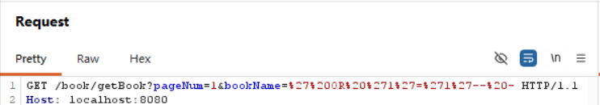

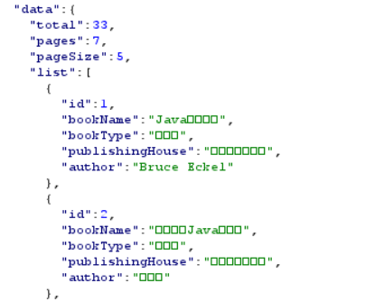

可以看到图片里返回了33本书，这是正确的

#### 步骤2、判断列数（ORDER BY)

理由：后面的union select要让左右列数一样，不然会报错

```Payload
ORDER BY 5 -- - 
```

这里我是知道我自己的页数，在不知道的情况下需要一个个试

如果正常返回：列数>=5

报错或者空：列数<5

5√  6 ×  →列数就是5

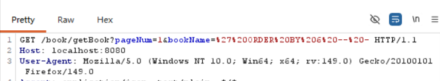

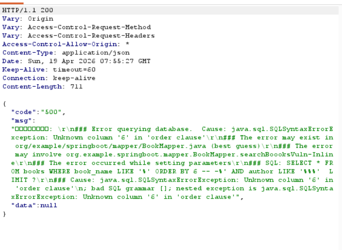

这一步我们就确定了列数是5

##### 步骤3、找显示位

UNION可以把两个查询结果拼接到一起，构造一个”假查询“，数据就会显示在页面上

```Payload
bookName=' UNION SELECT 1,2,3,4,5 -- -
```

右边的就是我们构造的假查询

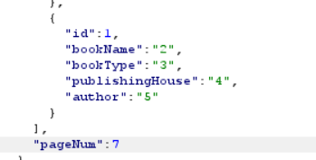

我这个有分页，而且没有排序，所以他会显示在最后一页，可以看到这个图片里显示了数字，这些就是我们找到的显示位

##### 步骤4、爆数据库版本

主要是确认一下环境，找到这个MYSQL的版本号，这里的显示位我用的是第2列

```Payload
bookName=' UNION SELECT 0,version(),3,4,5 -- -
```

0 ： id=0

version()：数据库内置函数，返回数据库版本

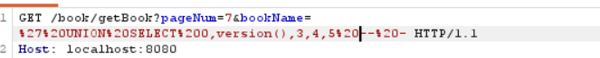

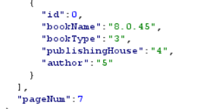

8.0.45就是我们提取出来的版本号

#### 步骤5、爆表名（获得数据库结构）

主要查看数据库里有哪些表格

```Payload
bookName=' UNION SELECT 1,table_name,3,4,5 FROM information_schema.tables WHERE table_schema=database() -- -
```

information_schema.tables 是 MySQL 的系统表，存储了所有表的信息

table_schema=database() 表示查询当前数据库的表

还是放在第2列显示

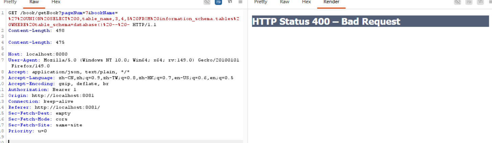

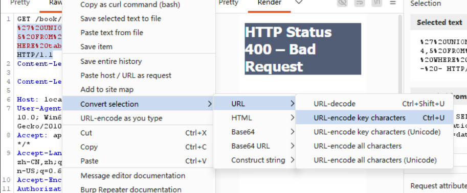

出现这个问题不要慌，查一下是不是格式有问题，根据上面的步骤统一一下编码，或者刷新一下重新抓包

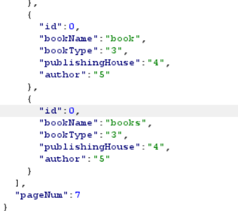

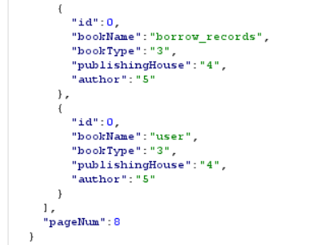

这四个表格就是我的数据库里的

##### 步骤6、爆字段名（找账号和密码）

查user表里有哪些列（id,username,password等）

还是一样的查information_schema,但这里是columns

```Payload
bookName=' UNION SELECT 0,column_name,3,4,5 FROM information_schema.columns WHERE table_name='user' -- -
```

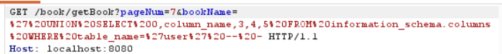

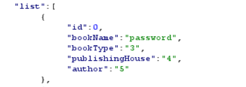

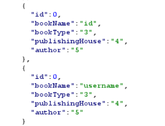

确认有username和password就可以

##### 步骤7、托库（偷username和password)

用CONCAT函数把这两个字段连接起来

```Payload
bookName=' UNION SELECT 0,CONCAT(username,':',password),4,5 FROM user -- -
```

注:一定要注意符号，容易漏打

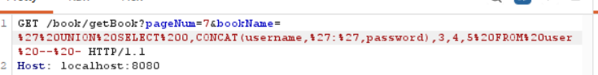

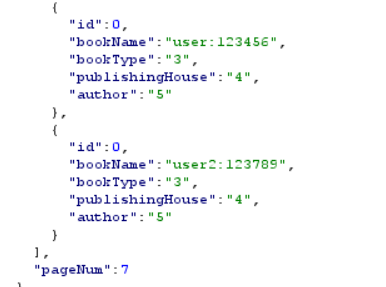

我这里有两个用户，可以看到完整的显示了

这个就是全过程

### 2.4修复方案

##### 修复代码：

```java
//【修复代码】使用 #{} 预编译参数，防止 SQL 注入
@Select("SELECT * FROM books WHERE book_name LIKE #{bookName} AND author LIKE #{author}")
List<Book> searchBooksSafe(@Param("bookName") String bookName,
    @Param("author") String author);
```

```java
//在 Java 层拼接通配符，SQL 使用 #{} 预编译
    return bookMapper.searchBooksSafe(
            nameEmpty ? "%" : "%" + bookName + "%", 
            authorEmpty ? "%" : "%" + author + "%"
    );
```

换成 #{} 后，不能再在 SQL 里写 % 了，因为 #{} 会把整个参数（包括 %）当作一个整体去匹配，所以要放到Java里去拼接

###### 如果用户没输入书名（nameEmpty 是 true），就传 "%"（匹配所有）

###### 如果用户输入了 Java，就拼接成 "%Java%"，然后传给 Mapper

这样既能模糊搜索，又不会有SQL注入风险

**注意：** 若需严格避免用户输入 `%` 或 `_` 被当作 LIKE 通配符，可对用户输入进行转义（如将 `%` 替换为 `\%`），或改用全文索引方案。本系统为演示场景，暂不处理。

## 三、水平越权漏洞

#### 3.1漏洞描述

通俗理解就是，A和B等级权限相同，但是A可以获取B的信息，就像取快递，A报B的取件码，把B的快递取走

本系统中，用户A可以通过修改URL中的`userId`参数，直接查看用户B的借阅记录。

#### 3.2漏洞代码位置：

BorrowRecordController.java

```java
 try {
            //直接用的前端传来的  没有判断用户  直接改URL里的userId=2 就能看别人记录
            List<BorrowRecord> records = borrowRecordService.getBorrowRecordsByUserId(userId);
            return Result.success(records);
        } 
```

###### 问题：

###### 这里的逻辑就是，前端想查就查，后端太信任，要什么给什么，没有查询是否是当前登录的用户

#### 3.3复现的步骤

##### 步骤1、准备两个账号

在网页里注册两个账号，这里我已经注册好了

前面的截图里可以看到

##### 步骤2、登陆其中一个账号，正常抓包

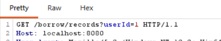

直接把这里的userId=1改成2

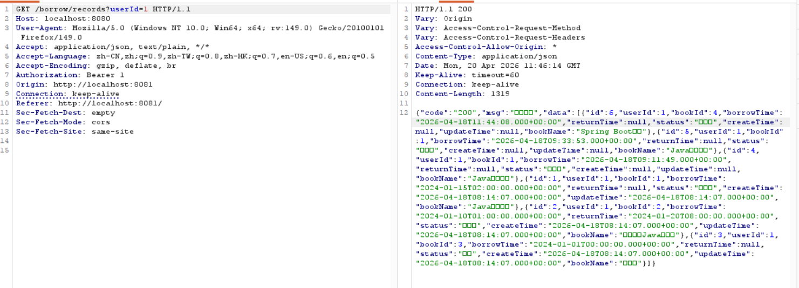

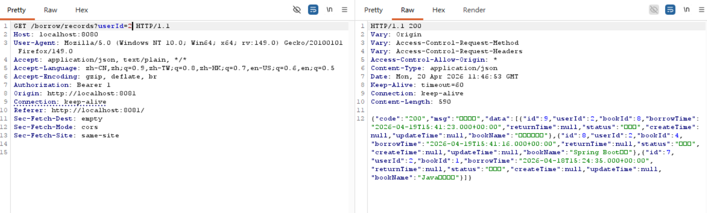

旁边就是user2的借阅记录，user就可以查看任何人的记录

#### 3.4修复方案

###### 修复代码：

```java
@GetMapping("/records")
public Result getBorrowRecords(HttpServletRequest request) {
    // 修复：从 Session 中获取当前登录用户的真实 ID
    HttpSession session = request.getSession();
    User currentUser = (User) session.getAttribute("loginUser");

    if (currentUser == null) {
        return Result.error("请先登录");
    }

    // 使用 Session 里的真实 ID，完全忽略前端传来的参数
    List<BorrowRecord> records = borrowRecordService.getBorrowRecordsByUserId(currentUser.getId());
    return Result.success(records);
}
```

```java
//修复：登录成功后，将用户信息存入 Session
                HttpSession session = request.getSession();
                session.setAttribute("loginUser", loginUser);
//从服务器内存里把刚才登录时存进去的 User 对象取出来。

                loginUser.setPassword(null); // 脱敏处理
                return Result.success(loginUser);
```

###### 修复原理：

水平越权产生的根本原因是**后端过度信任前端参数**。

修复的核心思想是身份强校验。

我在登录接口中引入了 **HttpSession**，用户登录成功后将 User 对象存入服务器 Session 中。 在查询借阅记录的接口中，不再接收前端传来的 userId，而是直接从** Session **中解析出当前登录用户的真实 ID 进行查询。 

这样，即使用户通过抓包工具篡改了请求参数，后端依然只返回属于他本人的数据，彻底阻断了越权路径。

- Session 是服务器端的一块内存空间。每个用户登录后，服务器都会给他分配一个唯一的 Session ID，存在浏览器的 Cookie 里，只要带着这个请求，服务器就知道是刚才登录的人。

## 四、总结与反思

通过本次对图书管理系统的代码审计，我获得了以下收获：

1. **安全编码意识**：永远不要信任前端传来的数据。SQL注入和越权的根源都是后端过度信任用户输入。
2. **防御的黄金法则**：防SQL注入用预编译（`#{}`），防越权用服务端Session校验，这两条是Web安全的基本功。
3. **攻击视角的价值**：亲自走一遍UNION注入的完整流程，比只看理论更能理解漏洞的危害性。
4. **文档沉淀的重要性**：将审计过程写成博客，既是自我复盘，也是向他人展示能力的有效方式。
